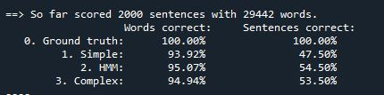
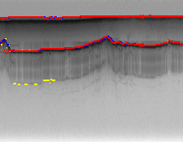
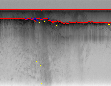
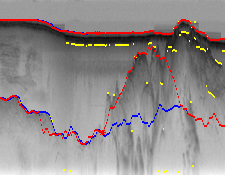

# Probability and Statistical Learning

## 1.1. Part 1: Part-of-speech tagging
### 1.1.1. Problem Statement 
Identify part of speech given word  using simple, HMM and complex baysean net

### 1.1.2. Data Set
- A large corpus of labeled training dataset given and also testing data for test the algorithm.
Each line consists of a sentence, and each word is followed by one of 12 part-of-speech tags
- The testing data is similar to the training data with sentences.Part of speech included with testing data can be used as ground truth. 
  
### 1.1.3. Methodology
#### Generating probabilities
Using given training dataset, various probabilities are generated. 

- Initial probabilities: We have counted number of times each POS appears at the beginning of sentence. We are using log probabilities and hence we have applied laplace smoothing in order to avoid error.

- Emission Probability : There were two different emission probability required to calculate for  this problem. Given a part of speech, probability of generating word. P(W1|S1) is calulated for Hidden Markov model. For more complex markov model P(W1|S1,S0) is also calcualted. 

- Transition probability : There were two different transition probability required to calculate for  this problem. Given a part of speech, probability of next POS. P(S1|S0) is calulated for Hidden Markov model. For more complex markov model P(S2|S1,S0) is also calcualted. 

#### Simplified Net:
For simplified net, only emission probability ( P(W1|S1) ) is used. For each given word, we calcualted probability of max \[ P(Wi | Si) ] is calculated and then for whichever POS we get maximum probability, that POS is selected as label. 

#### HMM Viterbi Model:
For HMM, we considered initial, simplified transition (P(Si | Si-1)) and emission probability ( P(W1|S1) ). Viterbi model starts from initial node using initial and emission probsbilities. Next state probability is calculated based on max viterbi and transition probabilities for each hidden states. A log of each states path is maintained. At the end of node, we starts backtracking from last node to first node and final labels are returned. 

#### Complex Net Model:
Complex net has complex baysean net. Apart from all connection we implemented in HMM, additional transition and emission probabilities were added. We have used Markov Chain Monte Carlo (MCMC) method to generate gibbs sampling. Initial few iterations were ignored in gibbs sampling. Initial samples are generated based on Simplified net probabilities. 

### 1.1.4. Conclusion / Problem Faced
Number of iterations to compute complex net model. It is observed that even small number of samples were generating good results. Due to time constraint, we need to reduce number of iterations. However it is still giving good comparable results comapared to HMM and Simplified model. 

Below is the final output for 2000 sentences:  

It is noted that results are comparable and complex net is performing on par with HMM and better than simplified net in sentence accuracy. 

---

## 1.2. Part 2: Ice tracking
### 1.2.1. Problem Statement
Given a echogram image of surface, we were required to find two boundary layers (air-ice and ice-rock)
P(L1, L2 | I) where L1 nad L2 represents first and second boundary and I represnts Pixel array of Image.

We need to calcualte this boundary using Simpliefied and HMM baysean net. Also, additionally out put can be improved by human feedback. 
It is always assumed that human feed back always lies on boundary layers.

### 1.2.2. Assumptions
- Rock boundary is condtionally not independent of air boundary. The air-ice boundary is always above the
ice-rock boundary.
- The two boundariesspan the entire width of the image.
- Each column has exactly one air ice boundary and one ice rock boundary pixel
- Boundaries are relatively smooth and deviates only within +/- 5 pixels
- That the pixels along the boundaries are generally dark. Darker pixels that are NOT near the boundary are generated by noise.

### 1.2.2. Simple Net
We have assumed that **each columns of image are independent of its neihboring column**.In order to detect edge we have calcualted gradient of each pixel in column and used that value as edge strength. By normalizing edge strength to maximum pixel strength (255) we were able to achive better boundaries. 
- we caluclated the edge strength and normalised edge stengths and used follwing equation for the output boundary coordinates array.
- We have used stepwise function to generate rock boundary after knowing air boundary. It is assumed that **rock boundary is condtionally not independent of air boundary**. 
   P (L2 | L1) = 0 if L2 < L1 + 10 otherwise
   P (L2 | L1) = 1
   
(**Reference** : Estimating bedrock and surface layer boundaries and confidence intervals in ice sheet radar imagery using mcmc, S. Lee, J. Mitchell, D. Crandall, G. Fox)

### 1.2.3. HMM Viterbi
#### Initial Probability:
The initial probability is calculated based on the image arrray shape. We have taken a **reasonalbe assumption** such that 
      -  There is a higher chance of air boundary between first 50 pixel from top. These stepwise probability reduces as we go further deeper.
      -  There is a higher chance of rock boundary between 50 to 120 pixel from top. As we go above or below, these probability reduces. 

#### Transition Probability:
Transition probability for each pixel is clacualted using smoothness factor. Along the same row, layer boundaries are assumed to be smooth. We have taken +/- 5 pixels to calcualte transition probability. Influence of 5 pixel above or below is assumed to be zero. 

#### Emission Probability:
Emission probabilities are used from Simplified net problem.

#### Rock boundary
Again, we implement rock boundary using stepwise function. It is always assumed that rock boundary is atleast  10 or more pixel below the air boundary. 

After calcualting all probabilities till end node, back tracking is perfromed in order to find correct sequence. 

### 1.2.4. Human Feedback
- We caluclated the state probabilities for each node incorporating the human input.
- It is always assumed that human input is correct and human input alweays lies on boundary layer. Viterbi probability for human cor-ordinate is taken as 1 and from there back and forward propogation performed to calculate sequence. Each hidden state for each pixel is stored and finally backtracked. Human feedback is just a slight tweak to viterbi algorithm approach with instead of calcualting initial boundary, we start from known column, row value and back and forward propogate.

### 1.2.5. Conclusion / Problems faced
- It is observed that image with more noise is not producing great results. Also, Since edge strength function normalized accross image, rock boundries strength is relatively lighter than air boundary. Also, for image with relatively not smooth boundary does not predict great results. (Image 23). However, human feedback does improves the results.

Sample output images:  
  
  

Above image works relatively fine for all 3 models

  

Above is image 23.

Currently other than test image 23, all other images provides reasonablly good results. Particularly image 23 has more noise and its ice rock boundary is not smooth. With smoothness assumption it is not producing great result for ice-rock boundary. In future complex net can be considered where current column pixel depends on previous two neighbors or more. Also techniques like gibbs sampling can be used. Better computer vision libraries can be used to filter edges and remove noise. 

---
## 1.3. Part 3: Reading text
### 1.3.1. Problem Statement

It is text recognization problem given a image. Generally it is very commonly used to recognize hand written letters and scanned documents.
Here we need to identigfy letter or alhabatic character given the image. 
P(Ci | I) where Ci stands for cerain alpha-numeric characters and puncturation. I stands for given character image. 
Problem needs to be solved using
- The simple Bayes net. 
- The HMM of with MAP inference (Viterbi).

### 1.3.2. Data Set
- There are two training files required for this problem. Character image training file is used to calcualte emission probabilities. More on how we calculated emission probabilities is mentioned below. While file containing corpus of text is used to calculate initial probability and transtion probability for each letter. Noisy Test images are given and used for calculating emission probabilities.

### 1.3.3. Assumptions and Probability Calculation:
**Assumptions**

- All the text in our images has the same fixed-width font of the same size.
- Our documents only have the 26 uppercase latin characters, the 26 lowercase characters, the 10 digits, spaces, and 7 punctuation
symbols, (),.-!?’"
- Naive Bayes assumption that our pixels are conditionally independent for each letter.

- For given a letter, each test image is compared with train image of that letter. We comapred each pixel in train image of the letter and test image letter and calcualtede noise value. Based on that we have used empirical formula to calcualte **emission probabilities**. More the noise, lower is probability and lesser chance of being that letter. 
- For **initial and transition probability** of letters are calcualted using training corpus of text data. Only certain alpha numeric characters and punctualtion is considered for this problem.

### 1.3.4. Methodology

#### Simple Baysean Net
- Simple model assumes that letters are independent of its neighboring letteres. Based on given emission probabilities it predicts the letter with maximum probability under naive bayes assumption. 
 P(Ci | I ) = max ( P(I | Ci) )

#### HMM Net 
- For HMM, we considered initial, transition (P(Ci | Ci-1)) and emission probability ( P(I|Ci) ). Viterbi model starts from initial node using initial and emission probsbilities. Next state probability is calculated based on max viterbi and transition probabilities for each hidden states. A log of each states path is maintained. At the end of node, we starts backtracking from last node to first node and final sequence of characters are returned. 

### 1.3.5. Conclusion / Problems faced
- For more noisy image, it predicts inaccurate results. For example, letter 'l', and number '1' almost have same number of dark pixels and with little noise, it predicts inaccurate results. However, HMM model considered transition probabilities and hence able to predict correct letters. It is still giving error for image with lot of noise. Better method to calculate emission probabilities can be explored.

Sometimes simplified model performs better than HMM. It is observed that combination of transition and emission is very important. Even though there is stronger emission probabilites, if transition probability is small, it can knock off the result. Also in future work, complex markov models can be considered. 

